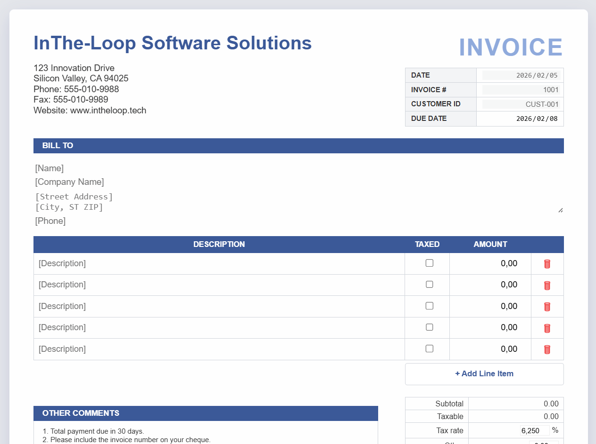
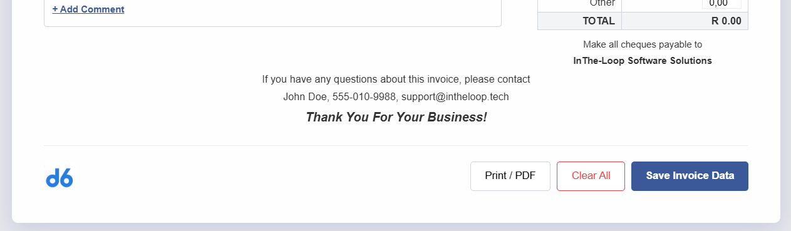
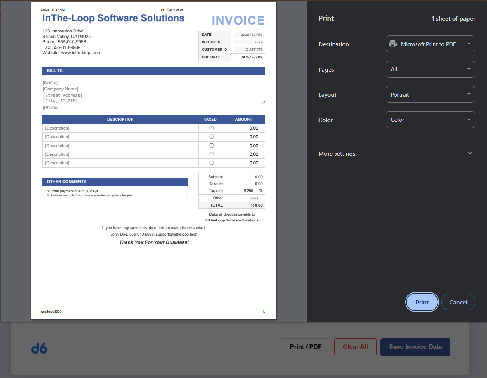
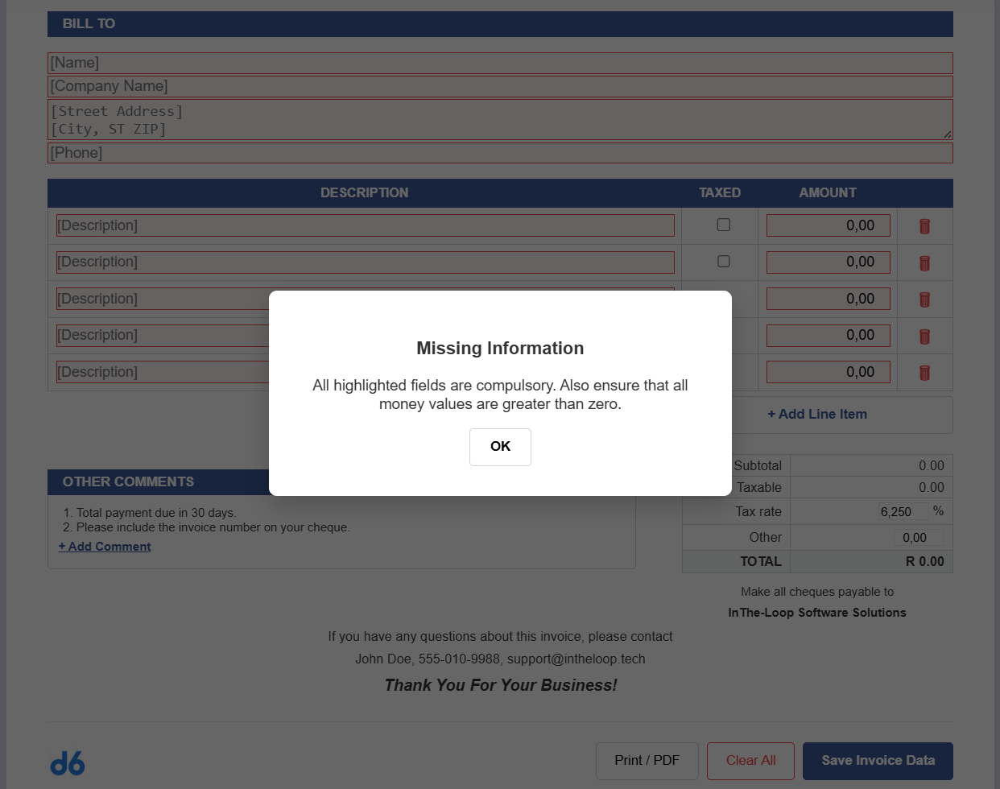
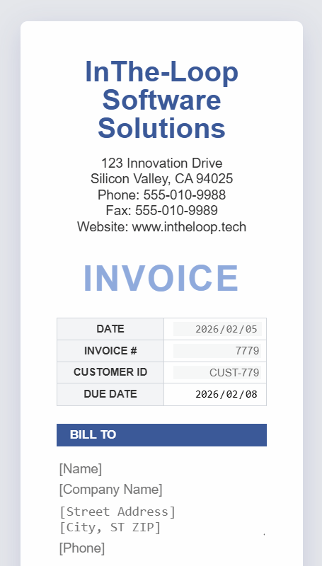
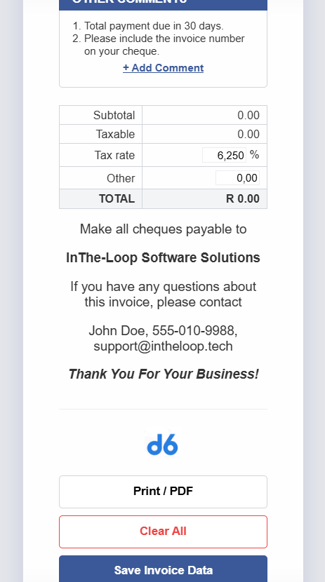

# Invoice Management Module

A modular, service-oriented PHP invoicing system designed as a component of a larger enterprise ecosystem.

### 1. Screens

Default View




Print preview



Error checks



Fully Mobile Responsive




## Architecture & Design Patterns

The system follows a strict `Layered Architecture` and adheres to `PSR-4 Autoloading` standards for organized, namespace-driven development.

* **Controller (`App\Controllers`)**: The entry point for HTTP requests. It handles input/output and HTTP status codes.

* **Service (`App\Services`)**: The business logic layer. It enforces domain rules (e.g., the 3-day rule) and manages database transactions.

* **Repository (`App\Repositories`)**: The data access layer. It abstracts SQL complexity and provides a clean interface for data persistence.

* **Models (`App\Models`)**: The data structures (DTOs). They handle self-validation and internal math (re-calculating tax totals to ensure data integrity).

* **Database Connection (`App\Database`)**: A Singleton pattern ensuring a single, efficient PDO connection across the application lifecycle.

## Database Schema & PSR-4

### 1. Schema Definition
The database structure is defined in database/schema.sql. It utilizes:

* **Relational Mapping**: A one-to-many relationship between invoices and invoice_items.

* **Key-Value Configuration**: A `system_settings` table to manage global state like tax rates and document numbering.

* **Data Integrity**: Foreign key constraints with `ON DELETE CASCADE` to maintain referential integrity.

### 2. Autoloading

This project implements the `PSR-4` Autoloading standard via Composer.

```
composer dump-autoload
```

This eliminates the need for multiple manual `require_once` calls and ensures that classes are loaded only when needed based on their namespace (`App\`).

```
"autoload": {
    "psr-4": {
        "App\\": "src/"
    }
}
```

## Getting Started

### 1. Prerequisites

* PHP 8.x
* Composer 2
* MySQL/MariaDB

### 2. Installation

1. Clone the repository at https://github.com/itwizz26/d6-invoicing-system onto your local environment and change directory into your new repo.
2. Install dependencies.

```
composer install
```

3. Copy `.env.example` into `.env` and update your database credentials accoridngly.

(Linux Terminal)
```
cp .env.example .env && nano .env
```

(Windows PowerShell)
```
Copy-Item .\.env.example .env
```

4. Database Initialisation (Seeding)

The system comes with a seeder that creates the necessary schema and populates system-wide settings (Currency, Tax rates, Company Info, and Counters). Run this command to seed the data and persist into the DB.

```
php database/seed.php
```

### 3. Running the server

To run the server, execute the command below and open the api endpoint at [/api/invoice.php](http://localhost:8000/api/invoice.php). You should see a json repsonse with the System Settings from the seeded data.

```
php -S localhost:8000
```

### Key System Features

* **3-Day Rule**: Server-side enforcement ensuring due dates are at least 3 days in the future.

* **Math Integrity**: The system re-calculates all totals on the server side to prevent frontend data tampering.

* **Auto-incrementing Identifiers**: Automatically manages INV-XXXX and CUST-XXXX sequencing via the system_settings table.

* **Atomic Transactions**: Uses PDO transactions to ensure that an invoice is only saved if all line items are successfully processed.

### 4. Unit testing

The system includes mock automated integration tests to verify business logic, server-side math integrity, and database persistence. Run this barebones PHP command to test the backend.

```
php tests/test_invoice.php
```

### 5. The frontend UI

The UI is written in plain HTML, CSS and JavaScript (ES6) and is fully mobile responsive.

Open the invoice generator [UI ](http://localhost:8000/) in the browser to interact with the frontend. Happy browsing!

## Future Roadmap & "Nice-to-Haves"
This project was built as a lightweight invoice generator, but it is architected for expansion. The following areas are recommended for future development stages:

### 1. Robust Testing Suite

To ensure the reliability of financial calculations and data integrity, implementing a testing layer is critical.

* **PHPUnit Integration**: Implement unit tests for the api/invoice.php logic, specifically focusing on tax calculations and JSON payload validation.

* **Frontend Testing**: Use tools like Cypress or Jest to simulate user interactions, such as adding line items and verifying that the "Grand Total" updates correctly.

### 2. Domain Expansion (The ERP Path)

The current "Invoices" domain can serve as the core of a larger Enterprise Resource Planning (ERP) system:

* **Payments Module**: Track partial payments, credit card processing integration, and payment status (Pending, Paid, Overdue).

* **Orders & Inventory**: Link invoices to "Sales Orders" and automatically decrement stock levels in an inventory table when an invoice is finalized.

* **Customer Portal**: Allow customers to log in, view their invoice history, and download PDF versions of past transactions.

### 3. Enhanced PDF Generation

While the current system uses @media print for browser-based printing, professional environments often require server-side PDF generation:

* **Dompdf or TCPDF**: Integrate a PHP-based PDF library to generate and save PDF files directly on the server for email attachments.

* **Automated Emailing**: Set up a cron job to automatically email invoices to clients on their invoice_date.

### 4. Advanced Security & Auditing

* **User Authentication**: Implement a multi-tenant login system so different companies can manage their own data securely.

* **Audit Logs**: Track every change made to an invoice (who changed the price, when was it marked as paid) for financial compliance.


## Copyright

&copy; 2026 [Daniel Mathebula](https://portfolio-c08.pages.dev/) <|> [(itwizz26)](https://github.com/itwizz26) <|> [LICENSE](LICENSE)
